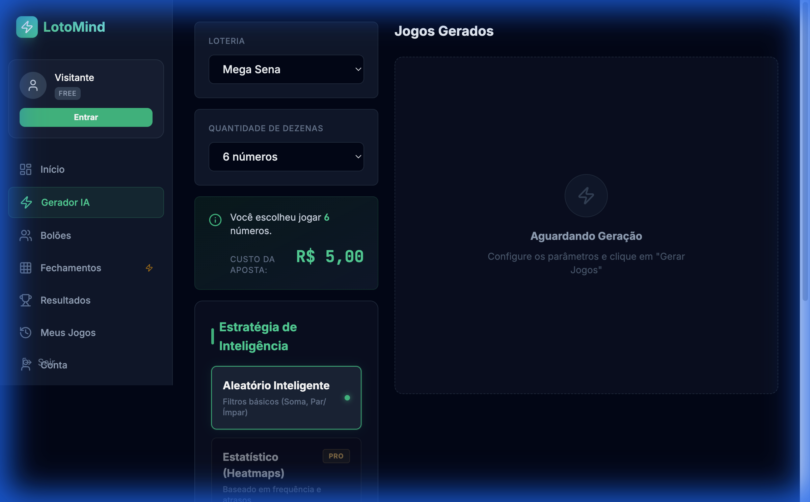
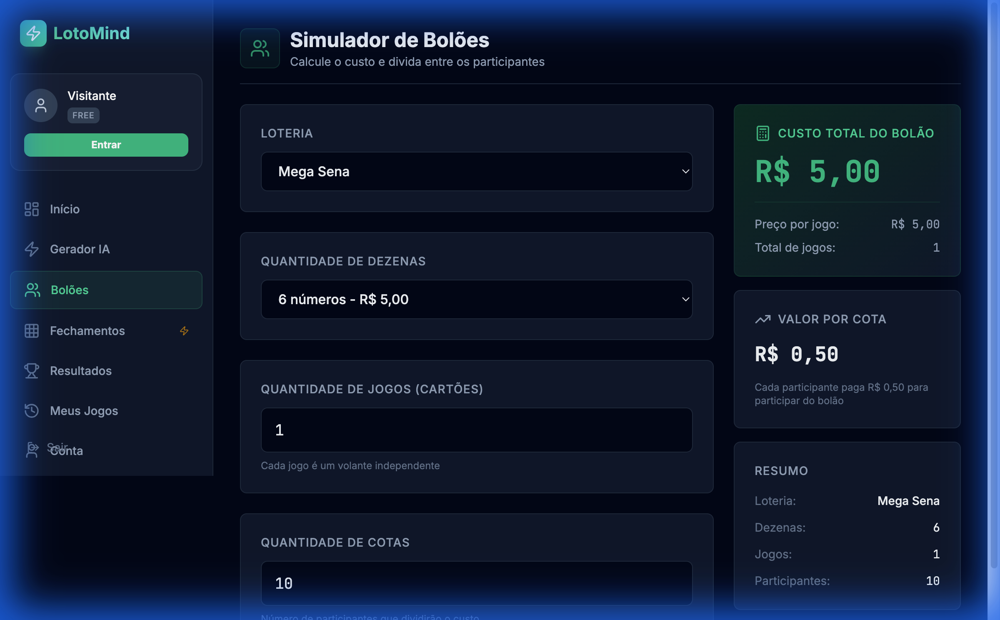

# 🎯 LotoMind AI - Gerador Inteligente de Jogos de Loteria

> Plataforma profissional de análise e geração de jogos de loteria com Inteligência Artificial

[]()
[]()
[]()
[]()

---

## 📋 Índice

- [Sobre o Projeto](#-sobre-o-projeto)
- [Funcionalidades](#-funcionalidades)
- [Tecnologias](#-tecnologias)
- [Instalação](#-instalação)
- [Uso](#-uso)
- [Screenshots](#-screenshots)
- [Estrutura do Projeto](#-estrutura-do-projeto)
- [Roadmap](#-roadmap)
- [Licença](#-licença)

---

## 🎲 Sobre o Projeto

**LotoMind AI** é uma plataforma SaaS profissional para geração inteligente de jogos de loteria. Utilizando algoritmos avançados de análise estatística e padrões matemáticos, o sistema oferece diferentes modos de geração para maximizar as chances de acerto.

### Diferenciais

- ✨ **Design Financial Dark** - Interface profissional inspirada em terminais Bloomberg
- 🧠 **4 Modos de Inteligência** - Random, Statistical, Matrix e Delta
- 💰 **Sistema de Preços Real** - Tabelas oficiais da Caixa Econômica Federal
- 👥 **Calculadora de Bolões** - Simule e divida custos entre participantes
- 📊 **9 Loterias Suportadas** - Mega Sena, Lotofácil, Quina e mais
- 🎯 **Análise em Tempo Real** - Cálculo instantâneo de preços e probabilidades

---

## ⚡ Funcionalidades

### 🎰 Gerador de Jogos

- **Seleção de Loteria**: Escolha entre 9 modalidades diferentes
- **Quantidade de Dezenas**: Configure de 6 a 15 números (varia por loteria)
- **Modos de Inteligência**:
  - **Random Smart**: Filtros básicos (gratuito)
  - **Statistical**: Análise de frequência e números quentes (PRO)
  - **Matrix**: Fechamentos matemáticos (PRO)
  - **Delta**: Sistema de diferenças (PRO)
- **Preço em Tempo Real**: Veja o custo da aposta instantaneamente
- **Exportação**: Salve seus jogos gerados

### 👥 Simulador de Bolões

- Configure jogos compartilhados entre múltiplos participantes
- Cálculo automático de:
  - Custo total do bolão
  - Valor por cota/participante
  - Resumo detalhado da configuração
- Suporte para até 1000 participantes
- Até 100 jogos por bolão

### 📊 Dashboard

- Próximo sorteio com contagem regressiva
- Últimos resultados oficiais
- Estatísticas e análises
- Histórico de jogos salvos

### 🎨 Design System

**Paleta Financial Dark:**
- Background: `slate-950` (#020617)
- Surface: `slate-900` (#0f172a)
- Primary: `emerald-600` (#059669) - Ações financeiras
- Secondary: `amber-500` (#f59e0b) - Premium/VIP
- Text: `slate-100` / `slate-400`

**Tipografia:**
- UI: **Inter** - Interface limpa e moderna
- Números: **JetBrains Mono** - Precisão financeira

---

## 🛠 Tecnologias

### Core
- **React 18** - Framework UI
- **TypeScript 5** - Type safety
- **Vite 7** - Build tool ultrarrápido

### Styling
- **Tailwind CSS 4** - Utility-first CSS
- **Shadcn/ui** - Componentes acessíveis
- **Lucide React** - Ícones modernos

### State Management
- **Zustand** - Estado global leve
- **React Hooks** - Estado local

### Utilities
- **date-fns** - Manipulação de datas
- **clsx** - Conditional classes
- **tailwind-merge** - Merge de classes

---

## 📦 Instalação

### Pré-requisitos

- Node.js 18+ 
- npm ou yarn

### Passos

```bash
# Clone o repositório
git clone https://github.com/diogosilvasantana/ia-loterias.git

# Entre no diretório
cd ia-loterias

# Instale as dependências
npm install

# Inicie o servidor de desenvolvimento
npm run dev

# Acesse http://localhost:5173
```

### Build para Produção

```bash
npm run build
npm run preview
```

---

## 🚀 Uso

### 1. Gerador de Jogos

1. Navegue para **"Gerador IA"** no menu lateral
2. Selecione a loteria desejada (ex: Mega Sena)
3. Escolha a quantidade de dezenas (6-15)
4. Observe o preço calculado automaticamente
5. Selecione o modo de inteligência
6. Defina quantos jogos deseja gerar
7. Clique em **"GERAR JOGOS"**

**Exemplo de Saída:**
```
Você escolheu jogar 9 números.
Isso custará R$ 420,00

Modo: STATISTICAL
Pontuação média: 87/100
```

### 2. Simulador de Bolões

1. Acesse **"Bolões"** no menu
2. Configure:
   - Loteria: Mega Sena
   - Dezenas: 8 números
   - Jogos: 5 cartões
   - Cotas: 20 participantes
3. Veja o resultado:
   - **Custo Total**: R$ 700,00
   - **Por Cota**: R$ 35,00

### 3. Planos

**FREE (Gratuito):**
- Modo Random Smart
- 10 créditos/mês
- Todas as loterias

**PRO (Premium):**
- Todos os modos de IA
- Créditos ilimitados
- Suporte prioritário
- Exportação avançada

---

## 📸 Screenshots

### Dashboard
> Tela inicial com próximo sorteio e últimos resultados


### Gerador de Jogos
> Interface de geração com seletor de loteria e cálculo de preço em tempo real



### Simulador de Bolões
> Calculadora de bolões com divisão de custos



### Modo Statistical
> Análise de frequência e números quentes


---

## 📁 Estrutura do Projeto

```
src/
├── components/          # Componentes reutilizáveis
│   ├── auth/           # Autenticação e proteção de rotas
│   ├── saas/           # Componentes SaaS (GameCard, StrategySelector)
│   ├── ui/             # Componentes base (Shadcn)
│   ├── LotteryBall.tsx # Bola 3D de loteria
│   └── PriceDisplay.tsx # Display de preços
│
├── config/             # Configurações
│   ├── lotteries.ts    # Definições de todas as loterias + preços
│   └── plans.ts        # Planos FREE e PRO
│
├── engine/             # Motor de geração
│   ├── CoreEngine.ts   # Orquestrador principal
│   ├── strategies/     # Estratégias de validação
│   └── matrix/         # Gerador de fechamentos
│
├── hooks/              # React Hooks customizados
│   ├── useAuth.ts      # Autenticação
│   └── useLotoMind.ts  # Interface com o engine
│
├── layouts/            # Layouts da aplicação
│   └── MainLayout.tsx  # Layout principal com sidebar
│
├── lib/                # Utilitários
│   ├── priceCalculator.ts # Cálculos de preço
│   └── utils.ts        # Helpers gerais
│
├── pages/              # Páginas da aplicação
│   ├── Dashboard.tsx   # Home
│   ├── Generator.tsx   # Gerador de jogos
│   ├── Syndicate.tsx   # Bolões
│   └── Matrices.tsx    # Fechamentos (PRO)
│
├── store/              # Estado global
│   └── userStore.ts    # Zustand store (user, credits, plan)
│
├── types/              # TypeScript types
│   └── domain.ts       # Tipos do domínio
│
└── data/               # Dados estáticos
    ├── megasena.json   # Resultados históricos
    └── *-stats.json    # Estatísticas calculadas
```

---

## 🗺 Roadmap

### ✅ Fase 1 - MVP (Concluído)
- [x] Design System Financial Dark
- [x] 9 Loterias com preços oficiais
- [x] Gerador com 4 modos de IA
- [x] Simulador de Bolões
- [x] Sistema de créditos e planos

### 🚧 Fase 2 - Em Desenvolvimento
- [ ] Painel Administrativo
  - [ ] Dashboard de métricas
  - [ ] Gestão de loterias
  - [ ] Gestão de banners
- [ ] Integração com API da Caixa (resultados em tempo real)
- [ ] Sistema de autenticação (Supabase/Clerk)

### 📋 Fase 3 - Planejado
- [ ] Análise avançada com Machine Learning
- [ ] Histórico de acertos
- [ ] Notificações de resultados
- [ ] App Mobile (React Native)
- [ ] API pública

---

## 🎯 Loterias Suportadas

| Loteria | Números | Preço Base | Máx. Dezenas |
|---------|---------|------------|--------------|
| **Mega Sena** | 6 de 60 | R$ 5,00 | 15 |
| **Lotofácil** | 15 de 25 | R$ 3,00 | 20 |
| **Quina** | 5 de 80 | R$ 2,50 | 15 |
| **Lotomania** | 50 de 100 | R$ 3,00 | 50 (fixo) |
| **Dia de Sorte** | 7 de 31 | R$ 2,50 | 15 |
| **Timemania** | 10 de 80 | R$ 3,50 | 10 (fixo) |
| **Dupla Sena** | 6 de 50 | R$ 2,50 | 15 |
| **+Milionária** | 6 de 50 + 2 trevos | R$ 6,00 | 12 |
| **Super Sete** | 7 colunas | R$ 2,50 | 7 (fixo) |

---

## 📄 Licença

Este projeto está sob a licença MIT. Veja o arquivo [LICENSE](LICENSE) para mais detalhes.

---

## 👨‍💻 Autor

**Diogo Silva Santana**

- GitHub: [@diogosilvasantana](https://github.com/diogosilvasantana)
- LinkedIn: [Diogo Silva](https://linkedin.com/in/diogosilvasantana)

---

## 🙏 Agradecimentos

- Dados oficiais: [Caixa Econômica Federal](https://loterias.caixa.gov.br)
- API de Resultados: [Loteriascaixa API](https://github.com/guto-alves/loterias-api)
- Inspiração de Design: Bloomberg Terminal, TradingView

---

<div align="center">

**⭐ Se este projeto foi útil, deixe uma estrela!**

Made with ❤️ and ☕ by Diogo Silva

</div>
